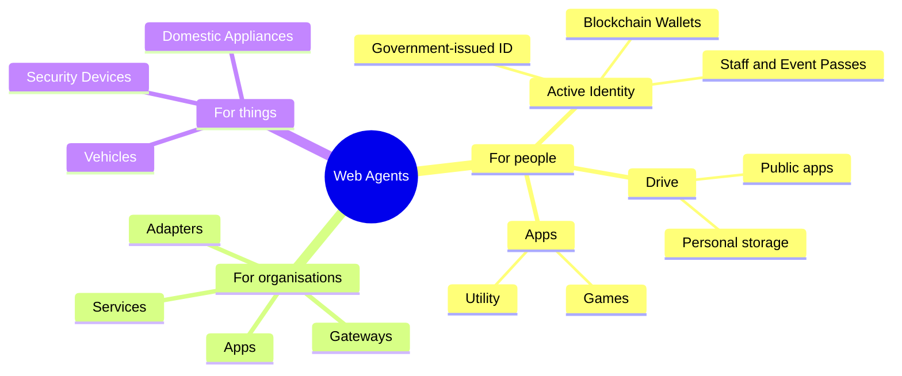

Web agents run on personal web agent servers. We call these _web daemons_.

Web daemons can make anything directly addressable on the web. For example:

  - `jane.doe.family` is a personal web daemon unique to one person, able to interact with business systems, personal wallets, websites or other web agents. For
    example, this might provide automatic login so Jane can forget passwords, expose functionality in a government-issued identity wallet, provide a 2FA capability,
    allow Jane to play multiuser games and share selected personal data to appropriate businesses.
  - `gateway.acme.com` is a business web daemon providing a set of services such as gateways for identify verification,
    biometric authentication, Shopify apps and a Twilio gateway to handle outbound text messaging.
  - `s-44-a433100002.iot.neff.com` is an IoT web daemon paired with a smart domestic appliance, providing
    a set of web agents for the manufacturer to collect data and provide updates; and for the consumer to manage the smart device.
