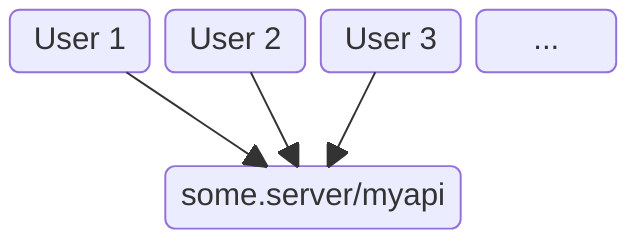
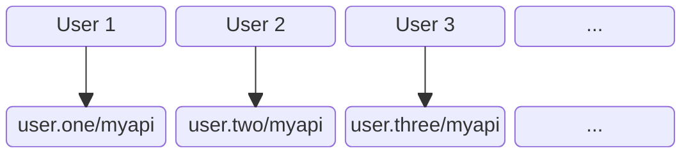

We [already said](../../start) a web agent is a personal server that thinks it's a browser.

As a developer, the key point to note is that the agent backend code you write does
not get deployed in one place - nor do you have to deploy it for your users.

Instead your agent code is dynamically deployed in a _different_ server with a _different_
host name, unique to each user.

## Centralised App
Let's suppose you've written a backend API called `myapi`.

In a traditional app, the user navigates to a web page. This expects to talk to a backend server
whose pre-configured name is usually the same for all users:

## Web Agent App
In a web agent app, when a user launches the app it talks to that user's personal agent
whose name is different from any other user:

## What's Different

1. Web agents use HTML to load and unload page backends on demand like a browser.
2. Each user has their own agent capable of running backends for many apps at once.
3. Identity, authentication and authorization come for free with the web agent security tokens.

## Standards

1. Standard web HTML, CSS, JS and Typescript.
2. Standard tooling such as React, Vite, Oak.
3. Standard HTTP interop to/from other personal agents and systems.
