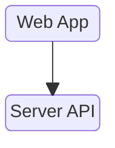
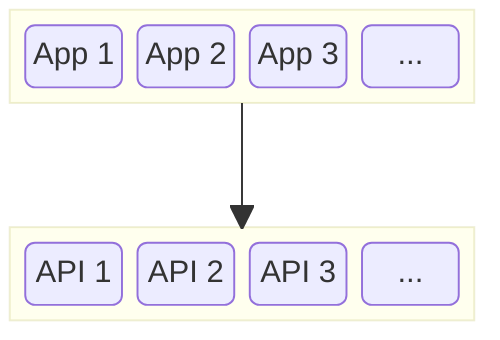

A web agent is a personal, dynamic server that loads and unloads APIs as quickly as your
browser loads and unloads pages.

## Traditional App
In a traditional app, we navigate to a web page which uses an API:
1. On a pre-deployed server
2. Shared by all users of the app.

## Web Agent App
In a web agent app, we navigate to a web page which uses an API:
1. On a dynamically loaded server
2. Personal to each user of the app.

## Differences

1. The web agent is personal to you.
2. The web agent (un)loads the app API as your browser (un)loads the app page.
3. Identity, authentication and authorization come for free with the web agent security tokens.
