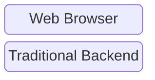
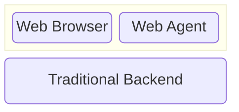

A web agent is personal to you. It can load and unload web servers
on demand, exactly like your browser can load and unload web pages on demand.

## Today's Apps
Normally we expect an app to have:

1. A personal frontend running in your browser.
2. A shared server running on a central system.

## Tomorrow's Apps
A web agent app adds a new dimension:

1. A personal frontend running in your browser.
2. **A personal server running in your web agent.**
3. A shared server running on a central system.

The personal server running in your web agent is unique to you _and_ the app.

It's different from a traditional backend because it's not shared.
It's different from a browser because it is always up and running.
