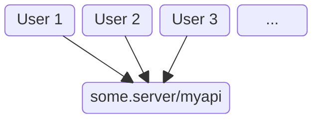
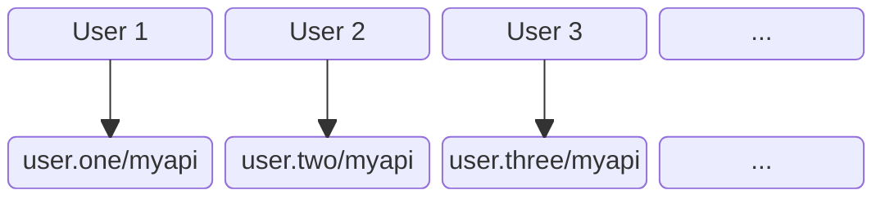

A web agent is a personal server paired with an individual web page.

As a developer, this adds a new dimension to your apps. Now you get an automatically
deployed backend for free.

More than that, the backend is unique to the user whose browser
loaded the app.

You place your web agent `.ts` files right alongside the `.html` and `.css` of your web page,
just like the `.js` files that execute in your user's browser.

Your agent code is automatically deployed to your user's web agent server (_web daemon_) when they load your app.

## Centralised App
Let's suppose you've written a backend API with the route `/myapi`.

In a traditional app, the user navigates to a web page. This is pre-configured to use `/myapi` on a server
whose name is shared between all users*:

## Web Agent App
In contrast, when a user launches your web agent app, `/myapi` is instantly deployed on their personal web agent server.
Your app talks to `/myapi` on this personal server, not to a central server:

## What's Different

1. Web agents are loaded and unloaded on demand like web pages in a browser.
2. Each user has their own web agent server (_web daemon_) capable of running agents for many apps at once.
3. Web agents are available 24/7 and can easily form decentralized peer-to-peer networks.
4. No login is needed because identity, authentication and authorization come for free with agent security tokens.

## Standards

1. Standard web HTML, CSS, JS and Typescript.
2. Standard tooling such as React, Vite, Oak.
3. Standard HTTP interop to/from other personal agents and systems.

{:.small}
*That's why users have to _log in_ - to distinguish themselves.
