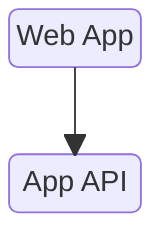
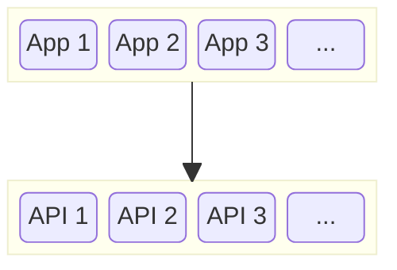

Previously we said a web agent is _a personal server that thinks it's a browser_.

In practice, your web agent uses HTML to load and unload server APIs as
quickly as your browser loads and unloads web pages.

## Traditional App
In a traditional app, we navigate to a web page which uses:
1. A pre-loaded app API
2. On a particular server
3. Shared by all users of the app.

## Web Agent App
In a web agent app, we navigate to a web page which causes:
1. The app API to be loaded dynamically
2. On a different server
2. Unique to each user of the app.

## Differences

1. Like a browser, your web agent uses HTML to load and unload app APIs on demand.
2. There is a different server for each app for each person.
3. Identity, authentication and authorization come for free with the web agent security tokens.

## Standards

1. Standard web HTML, CSS, JS and Typescript.
2. Standard tooling such as React, Vite, Oak.
3. Standard HTTP interop to/from other personal agents and systems.
