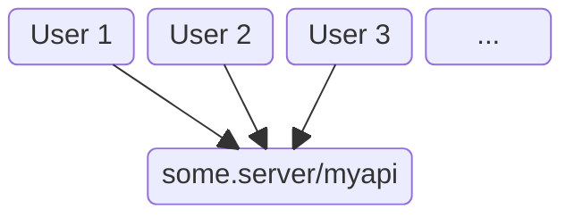
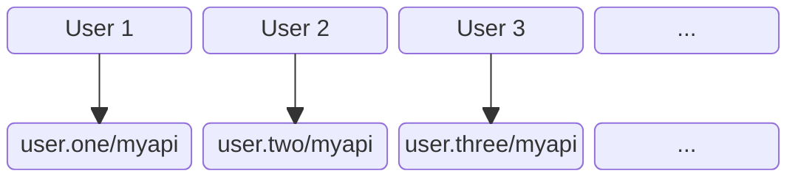

Web agent is the personal server that thinks it's a browser.

For developers, the main thing is _don't deploy your backend_.

Instead, the agent backend `.ts` files go right alongside the `.html` and `.css` of your web page,
just like the `.js` files that execute in your user's browser.

From there, your agent code is deployed to the user's web agent when they load your app.

## Centralised App
Let's suppose you've written a backend API with the route `/myapi`.

In a traditional app, the user navigates to a web page. This is pre-configured to use `/myapi` on a server
whose name is shared between all users*:

## Web Agent App
In contrast, when a user launches your web agent app, `/myapi` is instantly deployed on their agent. Your app talks
to `/myapi` on their agent, not a central server:

## What's Different

1. Web agents use HTML to load and unload page backends on demand like a browser.
2. Each user has their own agent capable of running backends for many apps at once.
3. Web agents are available 24/7 and can easily form decentralized peer-to-peer networks.
4. No login needed because identity, authentication and authorization come for free with agent security tokens.

## Standards

1. Standard web HTML, CSS, JS and Typescript.
2. Standard tooling such as React, Vite, Oak.
3. Standard HTTP interop to/from other personal agents and systems.

{:.small}
*That's why users have to "log in" to distinguish themselves.
