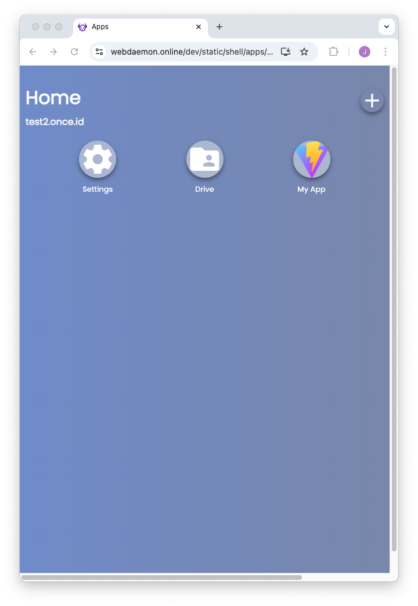

You can now install your app into your web daemon shell.

Make a note of:

1. Your web daemon URL which shows your web daemon home page.
   - e.g. `https://myname.once.id`
   - Remember each person has their own web daemon.
2. The app URL you made earlier.
   - e.g. `https://numerous-book-silk-fotos.trycloudflare.com/`
   - Remember this address is unique to the `cloudflared` you ran earlier.

# Step 1
In your browser:

- Navigate to your web daemon home by typing its address in the URL bar.

# Step 2
From your web daemon home page:

- Click the add icon top right.
- Enter the app URL.
- Click `Install`.

# Step 3
Click the **Contact Agent** button.

Your browser makes the request to your agent, which takes a second or two to load.

Then the button text changes to `Agent says hi!`.

# Step 4
Navigate back to your web daemon home page either directly or by using the back button
and clicking the home icon.

Note that **My App** is now shown in the shell, and from now on you can run it by clicking
on that icon.
