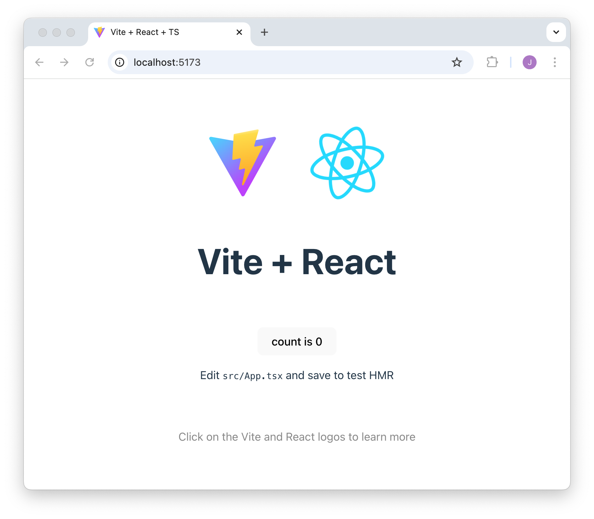
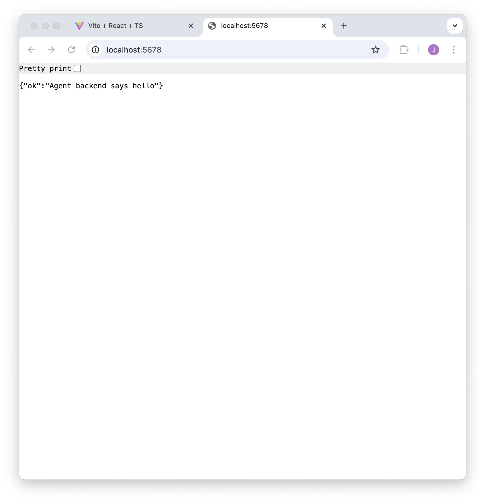

We'll start both the frontend web server and the agent API service locally
for development.

When we've got these working as we want, we'll hook them together.

# Step 1 - Frontend Server
- Start a terminal console for the frontend web server.
- Enter the `demo` directory and run the web server that will serve the app
  frontend on your local machine during development:

  ```shell
  cd demo
  npm install
  npm dev
  ```
- Note the displayed URL, for example `http://localhost:5173/`.
- Go to your browser and enter that same URL to check the frontend web app is being served:
  

# Step 2 - Backend Server
- Start a terminal console for the backend agent API server.
- Enter the `demo/backend` directory and run the server that will provide the
  app's agent API on your local machine during development:

  ```shell
  cd demo/backend
  deno run --allow-net --watch index.ts
  ```
- Note the displayed URL, for example `http://localhost:62496`
- Go to your browser and enter that same URL to check the backend API is up and running:
  
