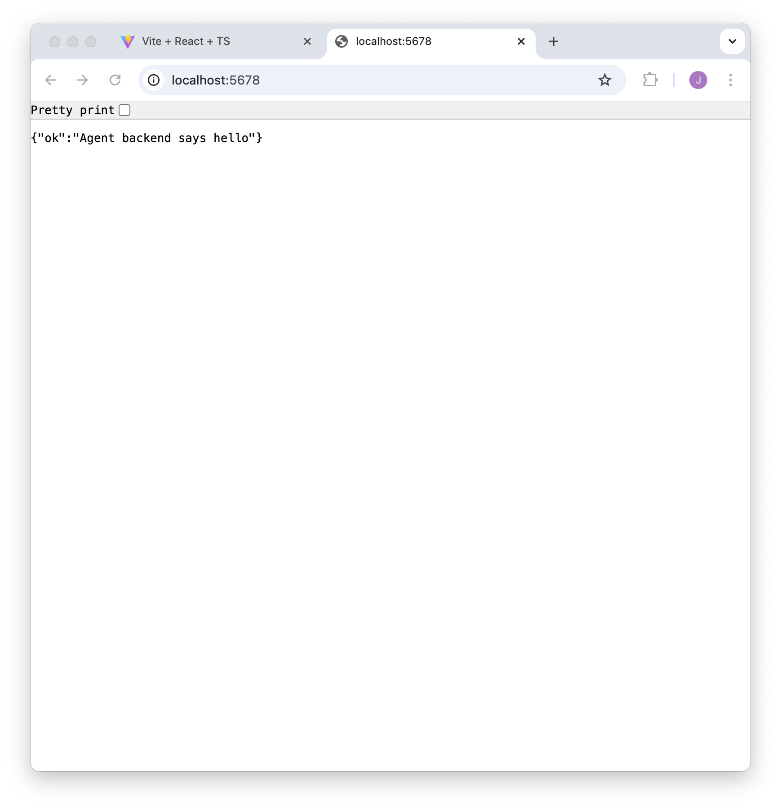

# Step 1
Open a new console window, create a subdirectory for the backend and go into it:
```shell
cd demo
mkdir backend
cd backend
```

# Step 2
Use your editor to create the file `index.ts` in that directory:

# `demo/backend/index.ts`
```typescript
import { parseArgs } from 'jsr:@std/cli/parse-args'
import { Lifecycle, response } from 'npm:webdaemon'

async function handler(request: Request): Promise<Response> {
  if (Lifecycle.shouldHandle(request)) {
    return Lifecycle.getInstance().handler(request)
  }

  return response({
    ok: 'Agent backend says hello'
  })
}

const args = parseArgs(Deno.args)
const port = Number(args.port ?? 0)
Deno.serve({port}, handler)
```
This is the server process that will run in the web agent on demand.

# Step 3
In the console, make sure you're in the `demo/backend` directory and run the server
specifying any available port:
```shell
deno run --allow-net --watch index.ts --port=5678
```

- Note the displayed URL, for example `http://localhost:5678/`.
- Go to your browser and enter that same URL to check the backend API is being served:
  
