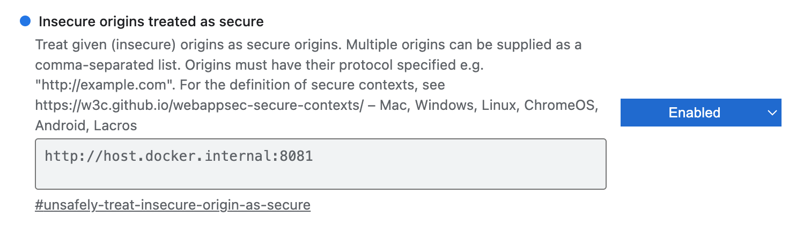

Make sure you have the following prerequisites completed:

1. Install the latest current version of `docker`.
   - Follow the instruction on the [Docker site](https://docs.docker.com/engine/install/)
   - `docker --version` 27.1.1 or later.
2. Install the latest current version of `deno`.
   - Follow the instructions on the [Deno site](https://docs.deno.com/runtime/getting_started/installation/)
   - `deno --version` 2.1.4 or later.
3. Update `/etc/hosts` with an entry for the special loopback `host.docker.internal`:
   ```
   # Match the docker container's name for the host computer
   127.0.0.1   localhost   host.docker.internal
   ```
   - `ping host.docker.internal` shows 127.0.0.1.
4. In the Chrome browser, set that origin to be a secure context:
   - Open `chrome://flags/#unsafely-treat-insecure-origin-as-secure`
   - Add the following origin and set the option to **Enabled**:
     `http://host.docker.internal:5173`
   - Relaunch Chrome when prompted.



Note that our React dev site will be on port `5173`.
There's nothing special about that, you can use a different port if you like.

In development, both browser and agent use `http:`. Normally, `https:` is required to
provide a secure context in a web page, hence the need to make this exception for development
purposes.

# Optional
If you wish to develop or test using `https:`, a good approach is to purchase a basic subscription
to the [ngrok](https://ngrok.com/) service. The free service is hobbled by an interstitial that
makes development a drag.

Then you can use an ngrok configuration file such as this:

`ngrok.yml`
```yaml
version: "2"
authtoken: <your ngrok token here>
tunnels:
  agent1:
    addr: 56032
    proto: http

  agent2:
    addr: 56032
    proto: http

  agent3:
    addr: 56032
    proto: http

  website:
   addr: 5173
   proto: http
```

This also allows `devdaemon` to provide multiple web daemons, each with
a unique ngrok-assigned name, rather than just the one whose name is `localhost:56032`.
