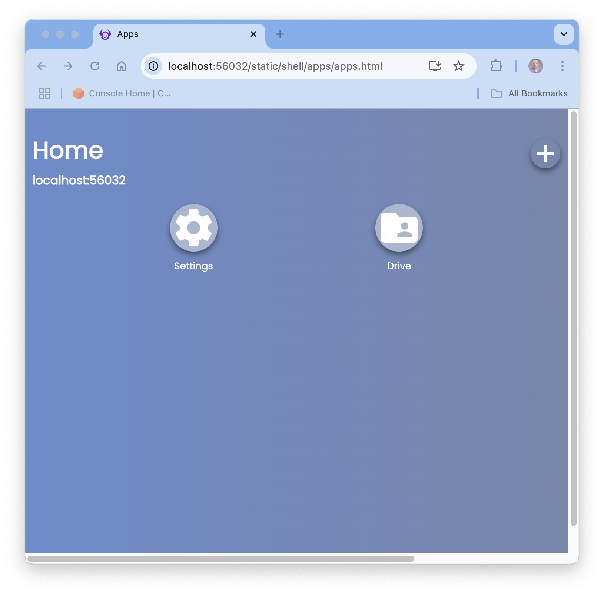
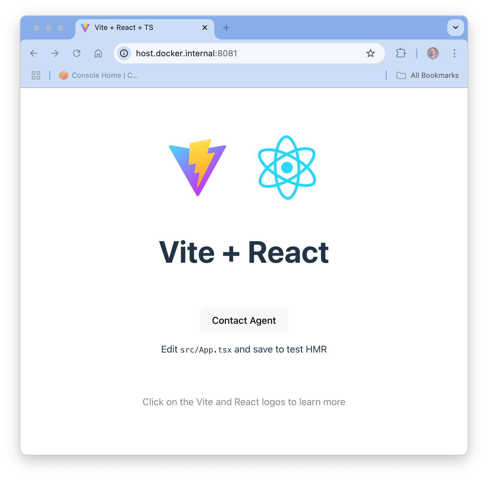
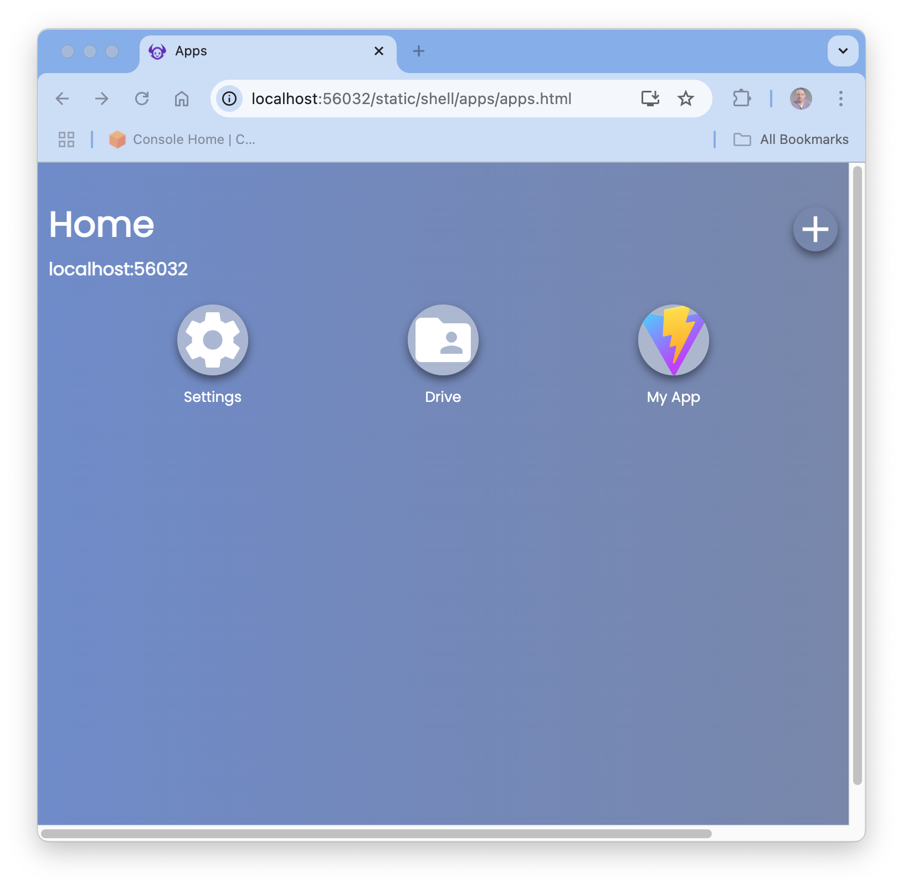

Now we can start `devdaemon` on your machine so you can run the web agent
portion of your app alongside the web page.

# Step 1
Use your console and make sure you are in your app directory `myapp`.

This is important because we reference the current directory using `$PWD` in step 2.

# Step 2
Start the development web daemon using `docker`:

```bash
docker run \
  --name devdaemon \
  --publish 56032:56032 \
  --mount type=bind,source=$PWD/agent,target=/mnt/agent \
  jacobythwaites/devdaemon:dev
```

If you look carefully, you'll see that we have mounted the disk directory that
contains the web agent code on the docker container which runs it.

# Step 3
The `devdaemon` container prints a message upon startup which includes a link
with code which opens the daemon shell in your browser.

  - [http://localhost:56032?code=b6b766](http://localhost:56032?code=b6b766)



# Step 4
You can now install the app into the shell:

- Click the <span class='material-icons'>add</span> icon top right.
- Enter the app URL `http://host.docker.internal:8081/`
- Click `Install`.

Note: You can't reference the app as localhost:8081, because the app URL must resolve correctly
for _both_ your browser _and_ the `devdaemon` container.



# Step 5
You can now click the **Contact Agent** button. The agent code runs and responds with the
text `Agent says hello!`.

# Step 6
Navigate back to the shell `http://localhost:56032` either directly or by using the back button
and clicking the <span class='material-icons'>home</span> icon.



Note that **My App** is now shown in the shell, and from now on you can run it by clicking
on that icon.
